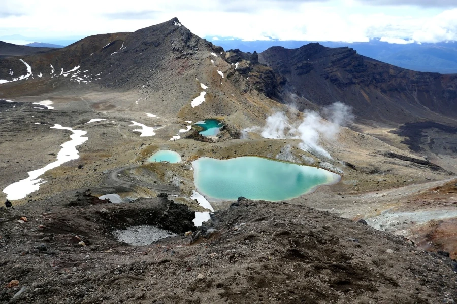
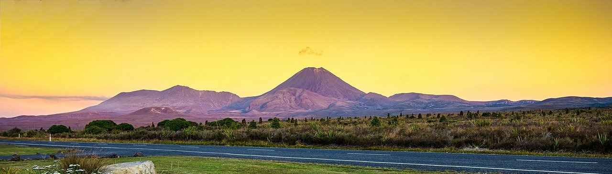

# Neuseelandreise HOWTO (Teil 1)

## HTML Grundgerüst

### a) Vorbereitung

* `index.html` Datei erstellen [🔗 COMMIT](https://github.com/webmapping/nz/commit/ee0cbf793a947f3c16e63ec766ab2370f199a6da)

* den **html 5** Baustein von VS Code einfügen [🔗 COMMIT](https://github.com/webmapping/nz/commit/d27001e181c77a7c4466e1d8d937f38664f2c5ad)

* **Sidestep: VS Code Hilfestellungen**
	* Bausteine wie z.B. oben, *autocomplete* bei allen Elementen, Attributen
    * Tooltips bei Elementen & Attributen *onmouseover*
    * Links zur [MDN Reference](https://developer.mozilla.org/en-US/docs/Web/HTML) für jedes html-Element verfügbar
    * mit dem "Live Server" Plugin können wir einen lokalen Webserver starten und uns die Seite (wie im Internet) ansehen

### b) Die HTML-Seite entwickeln

* Seitensprache über das lang-Attribut auf Deutsch ändern [🔗 COMMIT](https://github.com/webmapping/nz/commit/92bdf21a33bc46fe291fbce0cb4c3fde26773ee4)

    ```html
    <html lang="de">
    ```

* Seitentitel `title` ändern [🔗 COMMIT](https://github.com/webmapping/nz/commit/362c2f52c12d68e5896ce1274fbdf514f4d8fc1d)

    ```html
    <title>Neuseelandreise</title>
    ```

* Titel `h1` (für header 1) [🔗 COMMIT](https://github.com/webmapping/nz/commit/b1aabef1bfc436136c9f9d108a6ab727402b3156)

    ```html
    <h1>Neuseelandreise</h1>
    ```

* Untertitel `h2` (für header 2) und kursiv `em` (für emphasis) [🔗 COMMIT](https://github.com/webmapping/nz/commit/6ef9eb77e6e88a288cac3170987ec3e1f9dfbb85)

    ```html
    <h2><em>Tongariro-Nationalpark</em></h2>
    ```

* Introtext `p` (für paragraph) hinzufügen -  Wikipedia-Suche "*Tongariro-Nationalpark*", die ersten drei Absätze [🔗 COMMIT](https://github.com/webmapping/nz/commit/a4a2547502ef235ad3ccc86c008c66b31c6e94ff)

    ```html
    <p>Der Tongariro-Nationalpark  ... Vulkane als heilig verehren.</p>
    ```

* einen Begriff mit `strong` fett formatieren [🔗 COMMIT](https://github.com/webmapping/nz/commit/91cf5f6d8b4baef5ee2faca844eeae0296db4d61)

    ```html
    <strong>Kultstätten der Māori</strong>
    ```

* Link zur Quelle als `a` (wie anchor) [🔗 COMMIT](https://github.com/webmapping/nz/commit/4cc2d25cde980c1e6ea679a82cdc757fbd48a168)

    ```html
    (Quelle: <a href="https://...">Wikipedia</a>)
    ```

    * das Link-Ziel wird durch das href-Atrtribut (wie Hyperlink reference) bestimmt
    * der Linktext steht zwischen `<a href="">` und `</a>`

* ein Bild als Abbildung mit Bildunterschrift einbauen

    * zuerst suchen wir ein frei verfügbares Bild ohne Copyright Einschränkungen bei [https://pixabay.com](https://pixabay.com)
        * Suche "Emerald Lakes" führt zu [https://pixabay.com/photos/emerald-lakes-3189389/](https://pixabay.com/photos/emerald-lakes-3189389/)
        * wir öffnen das Vorschaubild gleich in einem neuem Tab und speichern es
            * in einem neuen Unterverzeichnis `images/`
            * mit dem Namen `attraction.jpg` (oder `attraction.webp` je nach Browser)
        * [🔗 COMMIT](https://github.com/webmapping/nz/commit/3f0b13d01da669fe15ee3bb6a725cde11e89694c)

    * die Abbildung als &lt;figure>-Element mit einem Bild als &lt;img>-Element [🔗 COMMIT](https://github.com/webmapping/nz/commit/641c36b189591f315bff525caa2aee3911fdc42e)

        ```html
        <figure>
            
        </figure> 
        ```

        * das &lt;img>-Element benötigt (mindestens) zwei Attribute
            * das **src-Attribut** (wie source) mit dem Ablageort des Bildes
            * das **alt-Attribut** (wie alternative) als Beschreibung des Bildes für Screenreader

    * die Bildunterschrift als &lt;figcaption>-Element mit einem Link zur Bildquelle [🔗 COMMIT](https://github.com/webmapping/nz/commit/2f5ff16ed1b8f102625dbc90787e093fda31cb03)

        ```html
        <figcaption>
            Blick auf die Emerald Lakes. Bild: <a href="https://pixabay.com/de/photos/emerald-lakes-3189389/">Laura7933</a>
        </figcaption>
        ```

* eine Linkliste mit drei weiterführenden Links vorbereiten [🔗 COMMIT](https://github.com/webmapping/nz/commit/67ecec8bb06ff29c67afc1a544db1b0453d3d851)

    ```html
    <h3>Links</h3>
    <ul>
        <li><a href=""></a></li>
        <li><a href=""></a></li>
        <li><a href=""></a></li>
    </ul>
    ```

* und mit Weblinks der Wikipedia-Seite komplettieren [🔗 COMMIT](https://github.com/webmapping/nz/commit/1ae9f113031de2e753e2d939040f26aa3ad4a5b0)

### c) Seitenstruktur verfeinern

* wir verpacken alles im &lt;body>-Element in ein &lt;article>-Element innerhalb eines &lt;main>-Elements [🔗 COMMIT](https://github.com/webmapping/nz/commit/a46418f8e07f896e874717bf65799fd5df98fbd6)

    ```html
    <body>
        <main>
            <article>
                <h1>Neuseelandreise</h1>
                ....
            </article>
        </main>
    </body>
    ```

* **Sidestep: Beautify Plugin**

    * das Beautify Plugin von VS Code hilft uns, die Einrückungen unter Kontrolle zu behalten
    * Aufruf nach der Installation:
        * **F1** + Beautify file (oder Beautify selection)
        * **STRG+UMSCHALT+P** + Beautify file
        * **View / Command Palette** + Beautify file

### d) Headerbereich mit Banner und Usericon erstellen

* wir brauchen zuerst ein Bannerbild für den Header von [https://pixabay.com](https://pixabay.com)
    * Suche "Tongariro" führt zu [https://pixabay.com/de/photos/tongariro-vulkan-herr-der-ringe-583179/](https://pixabay.com/de/photos/tongariro-vulkan-herr-der-ringe-583179/)
    * Version mit 1280 Pixel downloaden
        * im Unterverzeichnis `images/`
        * mit dem Namen `header.jpg`

    * Größe ändern mit [https://redketchup.io/](https://redketchup.io/)

        * *Image Resizer*
        * *Browse / Crop Dimensions*
        * 1280 x 365 Pixel einstellen
        * *Save Image*

        * [🔗 COMMIT](https://github.com/webmapping/nz/commit/ab83c65c9dc6d28f4e4502130ba6e9c54740acc8)

* wir bauen das Banner in einem neuen &lt;header>-Element als &lt;img>-Element ein [🔗 COMMIT](https://github.com/webmapping/nz/commit/e8b9ae6ae72afaa242c90898c8efa955021a9a95)

    ```html
    <main>
        <header>
            
        </header>
        <article>
        </article>
    </main>
    ```

    * **Hinweis**: im commit ist das &lt;header>-Element falsch positioniert und wurde erst später in das &lt;main>-Element verschoben (siehe [🔗 COMMIT](https://github.com/webmapping/nz/commit/39adb866c848f81e6ed8b478ea936ddceb83b59a)

    * das Bannerbild wird diesmal ohne &lt;figure>-Element direkt als &lt;img>-Element eingebaut

* analog zum Bannerbild suchen wir ein Userbild bei [https://pixabay.com](https://pixabay.com)

    * Suche "Bus" führt zu [https://pixabay.com/de/photos/vw-bus-vw-bully-volkswagen-meer-1845719/](https://pixabay.com/de/photos/vw-bus-vw-bully-volkswagen-meer-1845719/)

    * wir speichern wieder direkt das Vorschaubild
        * im Unterverzeichnis `images/`
        * mit dem Namen `user.jpg`

    * Größe ändern mit [https://redketchup.io/](https://redketchup.io/)

        * *Image Resizer*
        * *Aspect Ratio / Square*
        * Ausschnitt wählen
        * *Resize Dimensions*
        * 100 x 100 Pixel einstellen
        * *Save Image*

        * [🔗 COMMIT](https://github.com/webmapping/nz/commit/b43f7fcc4c18487a5effa0cdfc32e1c250115b6a)

* Userbild mit Bildquelle und Bild als Link direkt unter dem Bannerbild einbauen [🔗 COMMIT](https://github.com/webmapping/nz/commit/e21808f049f55fb1d429e7517381945b509720f5)

    ```html
    <a href="#"></a>
    ```

    * beim href-Attribut des Links verwenden wir die Raute (**#**) als Platzhalter, später werden wir das eigene github User-Repo verlinken
    * als *Linktext* verwenden wir das Bild statt einem Text

### e) Footerbereich mit Etappennavigation erstellen

* wir ergänzen ein &lt;footer>-Element
    * nach &lt;/article> und vor &lt;/main>
    * im &lt;footer>-Element ein &lt;nav>-Element mit zwei Links (# wieder als Platzhalter)

    ```html
    <footer>
        <nav>
            <a href="#">vorhergehende Etappe</a>
            <a href="#">nächste Etappe</a>
        </nav>
    </footer>
    ```

    [🔗 COMMIT](https://github.com/webmapping/nz/commit/ee315472fc320164e65dc40735bba92c38e080ee)

    * **Hinweis**: im commit ist das &lt;footer>-Element falsch positioniert und wurde erst später in das &lt;main>-Element verschoben (siehe [🔗 COMMIT](https://github.com/webmapping/nz/commit/8597361798774551015badbb004b05509881d3fb)

* Unicode-Zeichen für Pfeile unterstreichen die Richtung der Navigation

    * die Pfeile finden wir auf [https://unicode-table.com](https://unicode-table.com)

    * *Pfeile / 13. Navigation Arrows / Nach links gerichteter mittlerer Barb-Pfeil* [🔗 COMMIT](https://github.com/webmapping/nz/commit/ec3f305466a29624139a341b835f8ff01149bbb4)

    ```html
    <a href="#">🡨 vorhergehende Etappe</a>
    <a href="#">nächste Etappe 🡪</a>
    ```

### f) Userlink und Etappennavigation ergänzen

* mit Erstellung eurer github-Repos und der Zuteilung der github-User zu den Etappen können die #-Links noch angepasst werden

* Userlink zum github-Repo [🔗 COMMIT](https://github.com/webmapping/nz/commit/88816de52dc28c5116cc3edf3735d1d257c7d3c7)

    ```html
    <a href="https://github.com/webmapping"></a>
    ```

* Vor- und Zurücklinks für die Tongariro-Seite [🔗 COMMIT](https://github.com/webmapping/nz/commit/4eea9d580ef026e69e9d61390e9125ddd361d0b3)

    ```html
    <a href="https://paulasp3.github.io/nz/index.html">🡨 vorhergehende Etappe</a>
    <a href="https://andrea-1408.github.io/nz/index.html">nächste Etappe 🡪</a>
    ```
